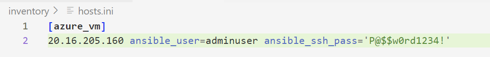
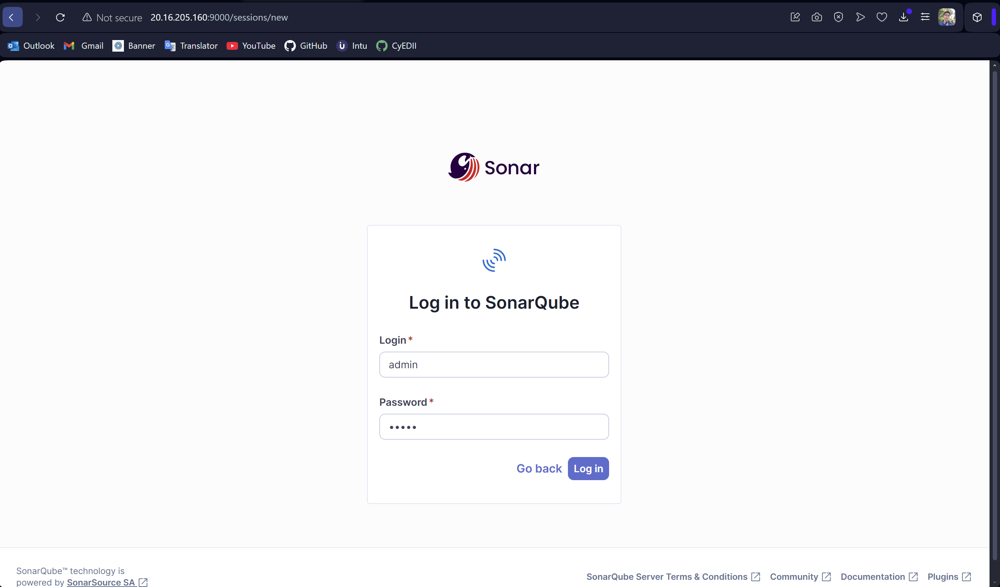
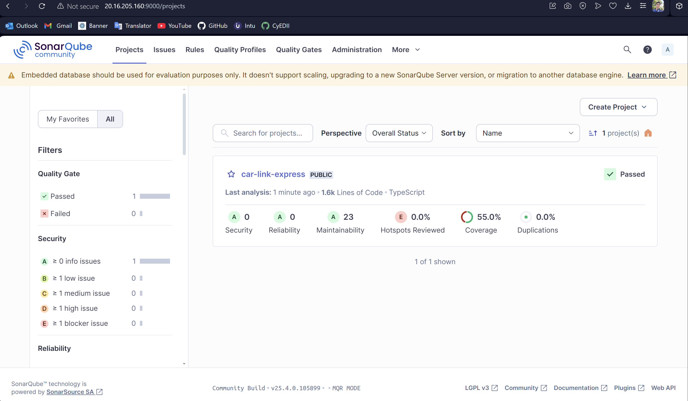

---

## Launch a SonarQube Service on a Virtual Machine with Ansible  
**Alejandro Londoño Bermúdez**  
**Software Engineering V**

---

### Step-by-step Guide

---

### **1) Deploy a Virtual Machine in Azure**  
Follow my guide on how to provision a VM using Terraform:  
🔗 [Azure VM Terraform Guide](https://github.com/Alejolonber25/azure_vm_terraform_guide)

Once the VM is running, note the **public IP** — this will be used for Ansible connection.

---

### **2) Configure the Ansible Project**

Create an **inventory file** defining your Azure VM credentials and group.

Example:  


---

### **3) Define Playbooks**

#### Install Docker  
Create a playbook to install Docker on the VM.  
Example:  


#### Run Docker Containers  
Create another playbook to launch the SonarQube stack using Docker Compose.  
Example:  


---

### **4) Define Ansible Roles**

#### Docker Install Role  
This role installs Docker and Docker Compose.  
Example:  


#### Docker Container Role  
Create a `docker-compose.yml` file with `sonarqube` and `postgres` services.  
Compose file example:  


Define tasks to launch the containers.  
Example:  


---

### **5) Execute Playbooks**

Run the roles with Ansible:

```bash
ansible-playbook -i inventory/hosts.ini playbooks/install_docker.yml
ansible-playbook -i inventory/hosts.ini playbooks/run_docker_container.yml
```

Execution examples:  
  


---

### **6) Access the SonarQube Service**

Navigate to:  
`http://<YOUR_VM_PUBLIC_IP>:9000`

Log in and generate a GitHub Actions token under **Security → Generate Tokens**.

Example steps:  
  
  


---

### **7) Configure GitHub Actions for SonarQube**

#### Create GitHub Secrets
Add the following secrets in your GitHub repository:

- `SONAR_TOKEN`
- `SONAR_HOST_URL` (e.g., `http://<YOUR_VM_PUBLIC_IP>:9000`)

Example:  


#### Configure Jest for SonarQube

Enable coverage output compatible with SonarQube.  
Example:  


#### Define GitHub Actions Workflow

Add a GitHub Actions workflow to trigger SonarQube analysis.  
Workflow example:  


---

### **8) View SonarQube Dashboard**

Browse to your SonarQube instance and view project insights.  
Example:  


---
